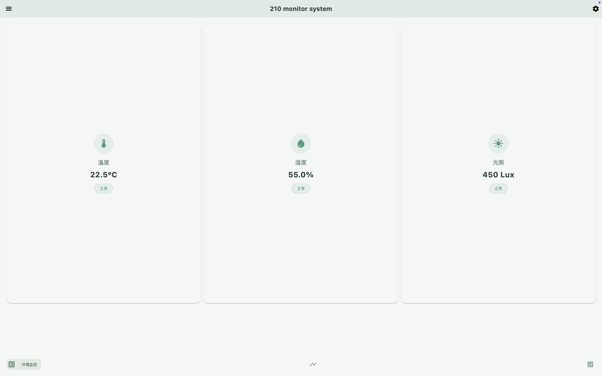
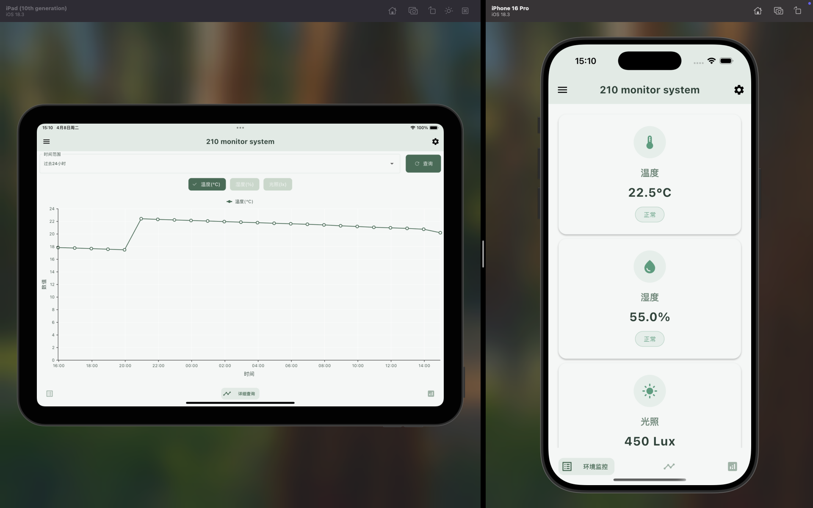
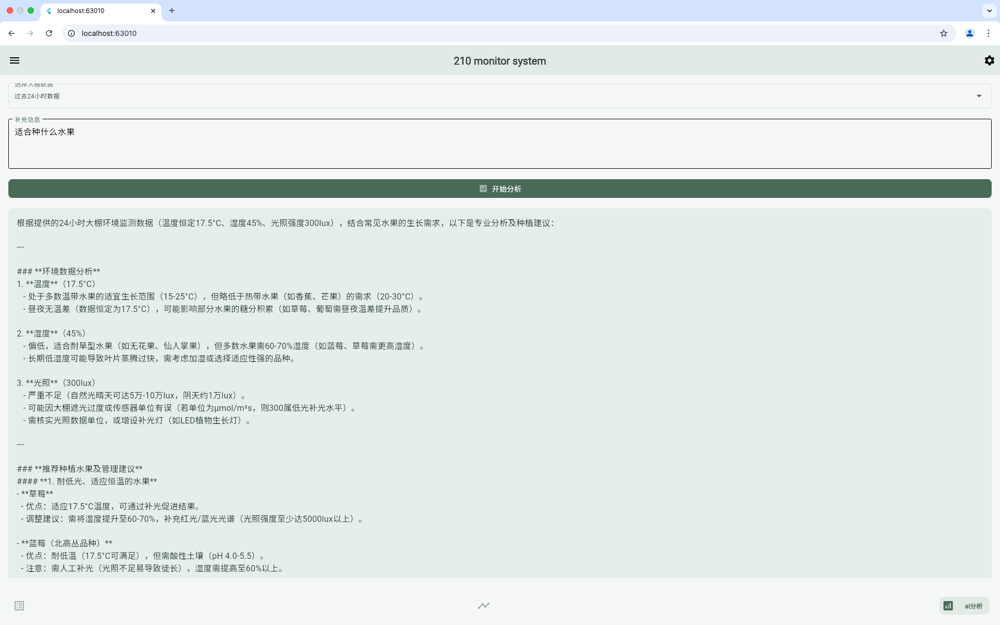

# 农业大棚环境监控系统客户端

这是一个基于 Flutter 开发的农业大棚环境监控系统客户端应用，用于实时监控和展示大棚内的环境数据，包括温度、湿度和光照等参数。该应用是《基于STM32的农业大棚环境监控系统》课程设计的客户端部分。

## 界面预览

### 主界面

主界面展示实时环境数据，包括温度、湿度和光照的实时监测。

### 统计分析

统计分析页面提供历史数据趋势图表，支持多种时间范围的数据查看。

### 智能分析

智能分析页面利用AI技术提供专业的农业建议。

## 功能特点

### 1. 实时数据监控
- 实时显示大棚内的温度、湿度和光照数据
- 支持数据自动刷新，确保信息及时性
- 数据可视化展示，直观呈现环境状态

### 2. 历史数据分析
- 支持查看过去24小时的数据变化趋势
- 可查看过去多天的数据统计
- 支持按月查看历史数据
- 数据以图表形式展示，便于分析

### 3. 智能分析功能
- 集成 DeepSeek AI 分析引擎
- 根据环境数据提供专业的农业建议
- 支持自定义分析描述，获取针对性建议

### 4. 系统设置
- 支持自定义服务器地址配置
- 可配置 DeepSeek API Key
- 设置持久化存储，重启应用后保持配置

### 5. 用户界面
- 现代化的 Material Design 设计
- 深色/浅色主题支持
- 响应式布局，适配不同设备
- 直观的数据展示和操作界面

## 运行环境要求

### 开发环境
- Flutter SDK: 3.0.0 或更高版本
- Dart SDK: 2.17.0 或更高版本
- Android Studio / VS Code
- Git

### 运行平台
- Android 5.0 (API 21) 或更高版本
- iOS 11.0 或更高版本
- Windows 10 或更高版本
- macOS 10.14 或更高版本
- Linux (支持 Flutter 的发行版)

## 环境搭建

1. **安装 Flutter SDK**
   ```bash
   # 下载 Flutter SDK
   git clone https://github.com/flutter/flutter.git
   
   # 添加 Flutter 到环境变量
   export PATH="$PATH:`pwd`/flutter/bin"
   ```

2. **安装依赖**
   ```bash
   # 进入项目目录
   cd mot_app
   
   # 安装项目依赖
   flutter pub get
   ```

3. **配置开发环境**
   - 安装 Android Studio 或 VS Code
   - 安装 Flutter 和 Dart 插件
   - 配置模拟器或连接实体设备

4. **运行应用**
   ```bash
   # 检查环境配置
   flutter doctor
   
   # 运行应用
   flutter run
   ```

## 系统架构

### 1. 整体架构
```
lib/
├── core/                 # 核心功能模块
│   ├── config/          # 配置文件
│   │   └── api_config.dart     # API配置
│   ├── mock_data/       # 模拟数据
│   │   └── mock_sensor_data.dart   # 传感器模拟数据
│   ├── models/          # 数据模型
│   │   └── sensor_data.dart   # 传感器数据模型
│   ├── services/        # 服务层
│   │   └── sensor_api_service.dart   # 传感器API服务
│   └── themes/          # 主题配置
│       ├── app_colors.dart    # 应用颜色
│       ├── app_text_styles.dart   # 文本样式
│       └── app_theme.dart    # 应用主题
├── features/            # 功能模块
│   ├── about/           # 关于页面
│   │   └── about_page.dart
│   ├── analyze/         # 数据分析
│   │   ├── analyze_page.dart    # 分析页面
│   │   └── uitl/
│   │       └── deepseek_api_service.dart  # DeepSeek API服务
│   ├── feedback/        # 反馈页面
│   │   └── feedback_page.dart
│   ├── home/            # 主页面
│   │   ├── home_page.dart      # 主页
│   │   └── widgets/
│   │       ├── custom_bottom_nav_bar.dart  # 底部导航栏
│   │       └── drawer.dart     # 侧边菜单
│   ├── monitor/         # 监控页面
│   │   └── monitor_page.dart   # 实时监控
│   ├── settings/        # 设置页面
│   │   ├── settings_model.dart    # 设置数据模型
│   │   ├── settings_page.dart     # 设置页面
│   │   └── settings_service.dart  # 设置持久化服务
│   └── statistics/      # 统计分析
│       └── statistics_page.dart   # 统计图表页面
└── main.dart           # 应用入口
```

### 2. 核心模块说明

#### 数据层
- `SensorData`: 传感器数据模型，包含温度、湿度和光照等环境数据
- `SensorApiService`: 传感器数据服务，负责与后端API通信获取实时和历史数据
- `DeepSeekService`: AI分析服务，基于DeepSeek API提供环境数据的智能分析

#### 状态管理
- `SettingsModel`: 应用设置管理，使用ChangeNotifier管理全局设置状态
- `SettingsService`: 设置持久化服务，使用SharedPreferences存储用户配置

#### UI 层
- `HomePage`: 主页面，整合底部导航和侧边菜单
- `EnvironmentMonitorPage`: 环境监控页面，实时显示传感器数据
- `StatisticsPage`: 统计页面，使用图表展示历史数据趋势
- `AnalyzePage`: 分析页面，提供AI智能分析功能
- `SettingsPage`: 设置页面，配置服务器地址和API密钥
- `AboutPage`: 关于页面
- `FeedbackPage`: 反馈页面

### 3. 数据流
1. 应用启动时从本地加载设置，初始化ApiConfig
2. 主界面通过TabBar组织多个功能页面，使用Provider共享服务实例
3. 监控页面从SensorApiService获取实时传感器数据并显示
4. 统计页面获取历史数据，使用SyncFusion图表库展示趋势
5. 分析页面根据用户选择的数据和描述，通过DeepSeekService获取AI分析结果
6. 设置页面更新配置时，保存到本地并更新ApiConfig

## 开发说明

### 代码规范
- 遵循 Flutter 官方代码规范
- 使用 Provider 进行状态管理
- 采用模块化设计，保持代码结构清晰

### 调试功能
- 支持模拟数据模式（USE_MOCK_DATA）
- 提供详细的错误处理和日志
- 支持热重载开发

## 注意事项

1. **API 配置**
   - 使用 DeepSeek API 需要配置有效的 API Key
   - 服务器地址配置需要确保网络可达

2. **数据刷新**
   - 实时数据默认自动刷新
   - 历史数据需要手动触发刷新

